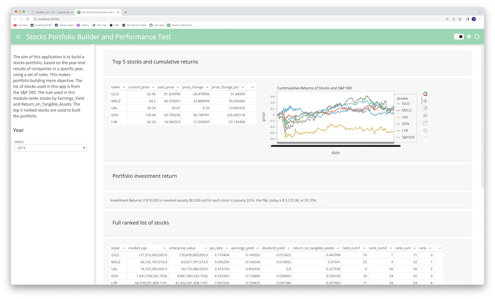
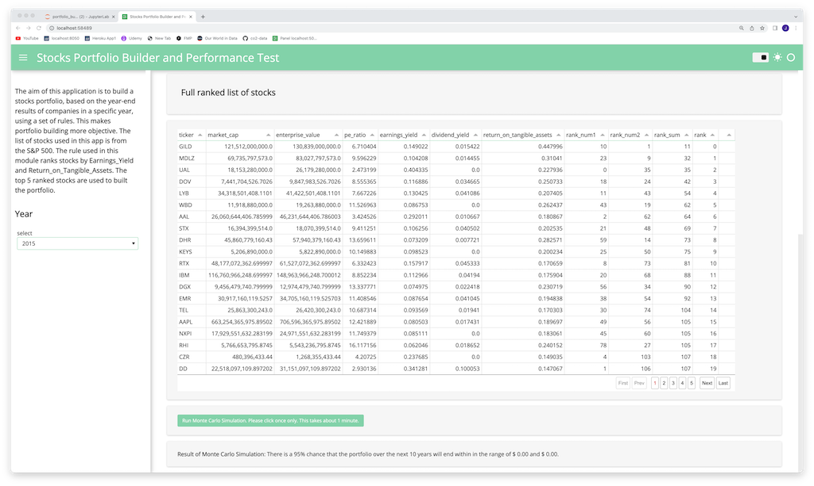

# Portfolio_Builder_and_Performance_Test

As a 'proof of concept', the application's scope is limited to analyzing the stocks in the S&P 500 list in 2022. Based on a year selected by the user (from 2010 to 2021), the app gets data for the selected year from an Sqlite database 'stocks_data_process.db'. This database contains data that was previously pulled from financialmodelingprep.com using API calls. This was done in module portfolio_builder.py.

The application then does the following:

1. Use a 'formula' in module portfolio_builder_calc_ranking.py to rank the companies by Earnings Yield and Return on Tangible assets, then pick only the top 5 companies for the portfolio. portfolio_builder_calc_ranking.py is the main module to modify to change the formula in future attempts have the app pick stocks with better return on investment.

2. Calculate the performance of the portfolio of 5 stocks, assuming $2,000 were used to buy each stock, by taking the diffence in the current stock prices and previous stock price. The previous buy is assumed to be done in the month of January in the following year, since the year-end results was used to apply the formula to find the top stocks.

3. Allow the user to run a Monte Carlo simulation to get the 95% confidence level range for how the porfolio will perform in the future, again assuing the stocks by were $2,000 each.

The application launces a PyViz Panel webpage

---

## Technologies

This application uses the following packages/modules:

* [Pandas](https://github.com/pandas-dev/pandas)
* [hvPlot](https://hvplot.holoviz.org)
* [SQLAlchemy](https://www.sqlalchemy.org/)
* [PyViz Panel](https://panel.holoviz.org/index.html)
* [requests](https://pypi.org/project/requests/)
* [Python json](https://docs.python.org/3/library/json.html)
* [alpaca_trade_api](https://alpaca.markets/deprecated/docs/api-documentation/)
* [Python-dotenv](https://pypi.org/project/python-dotenv/)
* [Python datetime](https://docs.python.org/3/library/datetime.html)

---

## Usage

In Windows GitBash or Mac Terminal app, enter "Jupyter Lab". Then open and run "app.ipynb".

The following files are part of the app developed in this project must be in the same directories as app.ipynb:

portfolio_builder_get_data.py
portfolio_builder_get_year_data.py
portfolio_builder_calc_ranking.py
FMP_Requests.py
stocks_data_processed.db

The images below shows the webpage that will be launched by app.ipynb.

---

## Contributors

This application is written by James Tan, Jimmy Choa and Vivian Liu.

---

## License

MIT License.